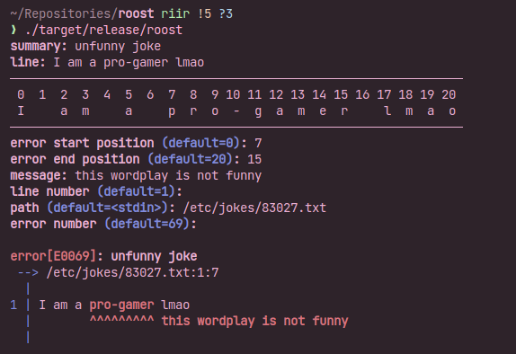

# Roost

Roost is a Rust error generator written in Python. It is meant to be used for jokes.

It's a simple script I've written in like 2 hours so don't expect the code quality to be good 😆.

## Usage

In the terminal, type:

```
python3 -m src.roost
```

Then, fill the fields ; it will print the error message at the end.

### `--output` option

You can write the error message (with the ANSI escape sequences) into a file.

To do so, you simply need to provide a valid file path after the argument, such as:

```
python3 -m src.roost --output /path/to/my_file.txt
```

## Screenshot


